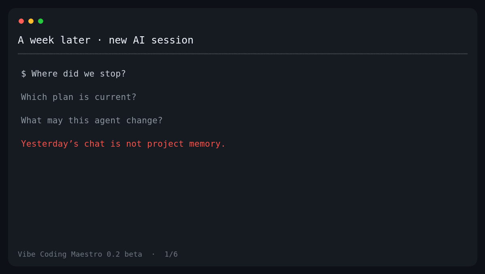

# Vibe Coding Maestro

<p align="center">
  <strong>Keep AI coding context in the repo—not in yesterday’s chat.</strong>
</p>

<p align="center">
  Open-source project memory and guardrails for long-running AI coding work.<br>
  Ordinary Markdown in Git, shared by people and different AI coding tools.
</p>

<p align="center">
  <a href="https://github.com/omikhaylov76-commits/vibe-coding-maestro/actions/workflows/ci.yml"></a>
  <a href="LICENSE"></a>
</p>

<p align="center">
  <a href="docs/USER_GUIDE.md">Подробное руководство на русском</a>
  ·
  <a href="#quick-start-from-source">Quick start</a>
  ·
  <a href="#safety-by-default">Safety</a>
  ·
  <a href="#documentation">Documentation</a>
</p>

> [!IMPORTANT]
> **0.2.0-beta.1 is an unreleased beta.** The npm package is not published yet, so `npx create-vibe-maestro@latest` is not a working installation command today. Use the source install below. The current CLI and generated project templates are Russian-first; English localization is planned before a global release.

When an AI-assisted project lasts longer than one chat, the same problems keep returning:

- a new session has to rediscover the project;
- decisions survive in old conversations but not in the repository;
- the plan, code, and documentation quietly drift apart;
- different agents receive different instructions;
- nobody can quickly prove which files and rules are still intact.

Vibe Coding Maestro creates one durable, Git-native place for that context. It gives the project shared Markdown memory, canonical working protocols, thin entry files for AI tools, and a deterministic `doctor` that checks mechanical integrity without calling an LLM.

It is **not another coding agent or IDE**. Keep using Claude Code, Codex, Cursor, or your preferred tools. Maestro gives them—and you—the same map.

## See the workflow in 20 seconds



The demo uses the real 0.2 beta CLI surface and output. It does not pretend that the npm package has already been published.

## Quick start from source

**Requirements:** Node.js 20.10 or newer, npm, and Git.

> [!TIP]
> ## 🚀 One command to start
>
> Copy this into your terminal and press Enter:
>
> ```bash
> git clone https://github.com/omikhaylov76-commits/vibe-coding-maestro.git 2>/dev/null || true && cd vibe-coding-maestro && git checkout main && git pull && npm ci && npm run build && node dist/bin/create-vibe-maestro.js
> ```

```bash
# 1. Get the beta source
git clone https://github.com/omikhaylov76-commits/vibe-coding-maestro.git && cd vibe-coding-maestro

# 2. Install and build
npm ci && npm run build

# 3. Create a new canonical project
node dist/bin/create-vibe-maestro.js \
  --yes \
  --target "../My Project" \
  --name "My Project" \
  --start idea \
  --depth standard
```

Maestro creates the project, initializes Git on `main`, makes the initial commit, and runs `doctor`. Then verify it again at any time:

```bash
node dist/bin/vibe-maestro.js doctor --path "../My Project"
```

Expected result:

```text
Vibe Coding Maestro doctor: всё сходится.
```

Prefer a guided setup? Run the CLI without flags:

```bash
node dist/bin/create-vibe-maestro.js
```

The Guided First Run explains where files will be created and asks for no more than three decisions. A simple project name creates the folder on your Desktop; an explicit path always wins. Set `NO_COLOR=1` if you need plain output.

> [!WARNING]
> **Core 0.2 creates new canonical projects only.** It can also re-check a complete project already created by the same canonical engine. It refuses to modify a non-empty, non-canonical directory—even with `--force`. Safe conversion of existing projects belongs to a separate future Converter.

## What you get

A Standard project starts with a structure like this:

```text
My Project/
├── AGENTS.md          # universal entry for compatible AI agents
├── CLAUDE.md          # Claude Code entry
├── .claude/commands/  # /status, /build, /wiki, /handoff adapters
├── protocols/         # canonical rules for planning, building and handoff
├── wiki/              # shared project memory, decisions, progress and audits
├── maestro/           # inbox and human-controlled discovery/audit runbooks
└── .maestro/          # manifest, ownership inventory and integrity metadata
```

The important part is not the number of files. It is the reading path every new session receives:

```text
wiki/hot.md
→ discovery
→ open audits
→ roadmap
→ current progress
```

From there, `protocols/build.md` routes the agent through the relevant rules, plan, tests, evidence, review, and handoff. The next session can continue from repository state instead of relying on a private chat transcript.

### Before and after

| Before Maestro | With Maestro |
|---|---|
| Decisions are scattered across chats | Confirmed context lives in Markdown and Git |
| Each agent gets a different explanation | `AGENTS.md`, `CLAUDE.md`, and adapters route to canonical protocols |
| “Where did we stop?” requires a long recap | `wiki/hot.md` and handoffs hold the current state and next step |
| Drift is noticed manually, often late | `doctor` checks known mechanical invariants deterministically |
| Ownership is implicit | Managed, project-owned, generated, merged, and immutable paths are explicit |

## A normal working cycle

1. Put notes or source material in `maestro/inbox/`.
2. Use the included discovery runbook to separate sources, assumptions, MVP, non-goals, and open questions.
3. Review the result as a human and save approved context in the wiki.
4. Let an AI coding tool read `AGENTS.md` or its native adapter before it plans or edits.
5. Build with tests and live evidence.
6. Run `doctor`.
7. Create a handoff so the next session starts with the exact current state.
8. Record independent audit findings with stable IDs; open `high` or `critical` findings block a green doctor result.

Claude Code projects also receive four thin commands:

- `/status` — read current context without changing files;
- `/build` — follow the canonical build protocol;
- `/wiki` — reconcile allowed project memory;
- `/handoff` — record the state and update `wiki/hot.md`.

## Safety by default

Maestro is deliberately conservative around existing data and Git state:

- it refuses a non-empty, non-canonical destination before writing;
- a copied or forged manifest is not enough—the canonical identity, inventory, and actual tree must agree;
- `--force` only repeats initialization for a valid canonical project;
- repeat initialization is not an implicit repair command: an incomplete canonical tree is rejected without writing;
- user-owned files are not silently overwritten or deleted;
- protected paths and their parents are checked for symlinks, including dangling links;
- Git bootstrap uses `main`, does not run `git add -A` over unrelated work, and does not change global Git configuration;
- `doctor` is deterministic, has versioned JSON output, and makes no LLM call;
- `doctor --strict` also treats warnings as blocking;
- audit findings must be resolved with evidence; `waived` is not accepted by the 0.2 beta contract;
- there is intentionally no `doctor --fix` that could overwrite useful work.

`doctor` checks known mechanical boundaries such as manifest identity, ownership inventory, managed checksums, protocol contracts, wiki links, source integrity, tracked environment files, audit structure, blocking findings, and protected-path symlinks.

These protections reduce accidental damage. They do **not** make Maestro a sandbox, backup system, digital signature, or proof that the code and product decisions are correct. Read the complete [threat model](docs/THREAT_MODEL.md).

## Choose a depth

All depths are projections of one canonical system, not separate products.

| Depth | Best for | What changes |
|---|---|---|
| `light` | Small experiments and short projects | Minimal continuity and integrity surface |
| `standard` | Most solo and small-team projects | Full planning, progress, review, and handoff path; default |
| `advanced` | Longer or higher-risk work | Additional architecture, seams, audit, and lessons contracts |

Choose non-interactively with `--depth light|standard|advanced`. The Guided First Run uses `standard` by default so a new user does not have to decide immediately.

## When Maestro helps—and when it does not

### Maestro is a good fit when

- an AI-assisted project lasts more than a few sessions;
- you switch between people, models, or coding interfaces;
- you repeatedly explain the same constraints and decisions;
- Git state, ownership, auditability, and safe handoff matter;
- you want portable Markdown rather than provider-locked chat memory.

### Maestro is probably unnecessary when

- the task is a one-off script or a short disposable prototype;
- you do not use Git or filesystem-aware AI tools;
- you want an autonomous agent that designs and writes the product for you;
- you need to retrofit an existing non-canonical repository today;
- you need enterprise access control, cloud sync, SSO, or a hosted dashboard.

Maestro also cannot replace project tests, backups, code review, or human judgment.

## Integration status

The core format is vendor-neutral; integration depth is not identical across tools.

| Interface | Level in 0.2 beta | What is available |
|---|---|---|
| Humans | Native | Plain Markdown, Git diffs, explicit ownership, runbooks |
| Claude Code | Native adapter | `CLAUDE.md`, four project commands, code-reviewer adapter |
| Codex and other `AGENTS.md` tools | Generic adapter | Universal `AGENTS.md` entry into canonical protocols |
| Cursor and other filesystem-aware tools | Generic | They can read the same Markdown; no dedicated adapter yet |
| Cowork-style research/audit | Runbook | Copyable discovery and independent-audit workflows; human imports the result |

“Generic” means the shared files are usable; it does not claim the same tested UX as the native Claude Code adapter.

## Automation and CI

For scripts, pass every decision explicitly:

```bash
node dist/bin/create-vibe-maestro.js \
  --yes \
  --target "../My Project" \
  --name "My Project" \
  --start materials \
  --depth standard \
  --json
```

Useful service commands:

```bash
node dist/bin/vibe-maestro.js doctor --path "../My Project" --json
node dist/bin/vibe-maestro.js doctor --path "../My Project" --strict
node dist/bin/vibe-maestro.js skills --path "../My Project"
```

The repository release gate covers tests, type checking, build, audit, source acceptance, packed-tarball installation, all three depths, paths with spaces, deterministic doctor JSON, protocol drift, canonical identity forgery, incomplete canonical trees, forbidden audit waivers, and symlink boundaries. CI is configured for Ubuntu, macOS, and Windows with Node.js 20 and 22.

## Current beta scope

Available now in the source beta:

- Guided First Run;
- fresh canonical project creation;
- `light`, `standard`, and `advanced` depth projections;
- shared project memory and handoffs;
- canonical protocols with thin adapters;
- manifest, ownership inventory, checksums, and deterministic doctor;
- safe Git bootstrap;
- discovery and independent-audit runbooks;
- project-local skill inventory;
- JSON and strict CI modes;
- source and packed-install acceptance.

Not available yet:

- npm installation;
- safe conversion of existing non-canonical projects;
- English-generated templates;
- cloud sync, accounts, team dashboard, or billing;
- automatic installation or execution of third-party skills;
- a guarantee that an AI agent will not make mistakes.

The next step is real dogfooding and a small number of guided beta installations. Public npm release comes only after those workflows hold up outside the repository.

## Documentation

- [Detailed user guide (Russian)](docs/USER_GUIDE.md)
- [Threat model](docs/THREAT_MODEL.md)
- [Canonical-only boundary and future Converter](docs/MIGRATION_V1.md)
- [Contributing and local release gates](CONTRIBUTING.md)

Found a confusing step or a safety problem? Please [open an issue](https://github.com/omikhaylov76-commits/vibe-coding-maestro/issues/new) with the command you ran, expected result, actual result, OS, Node version, and a redacted tree or log. Never include credentials or private source material.

## License

[MIT](LICENSE). The project memory format, core CLI, doctor, base protocols, and security fixes remain open source.
